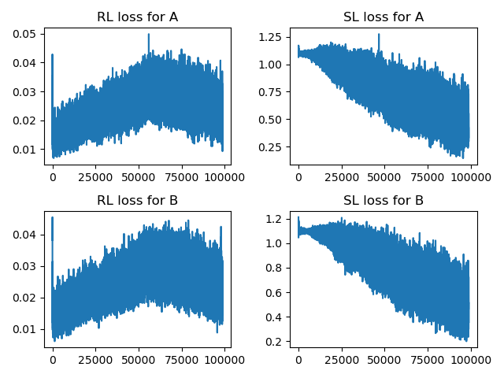
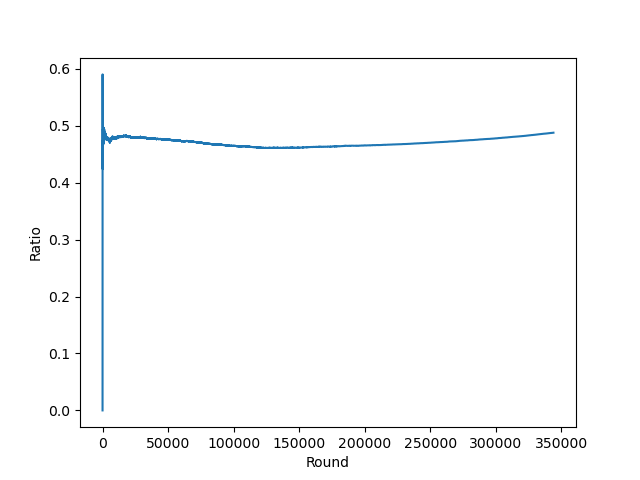
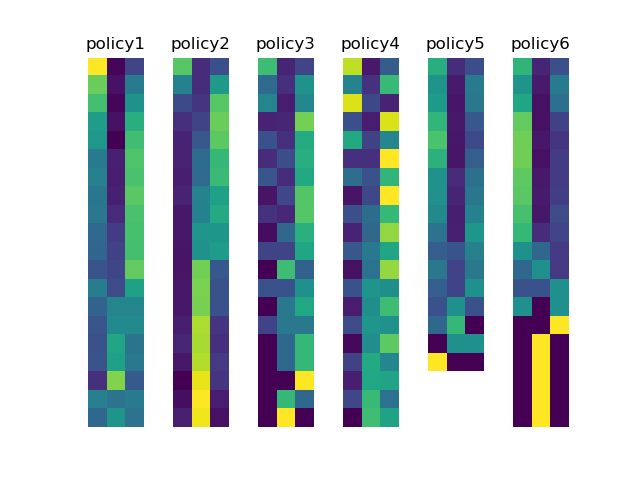
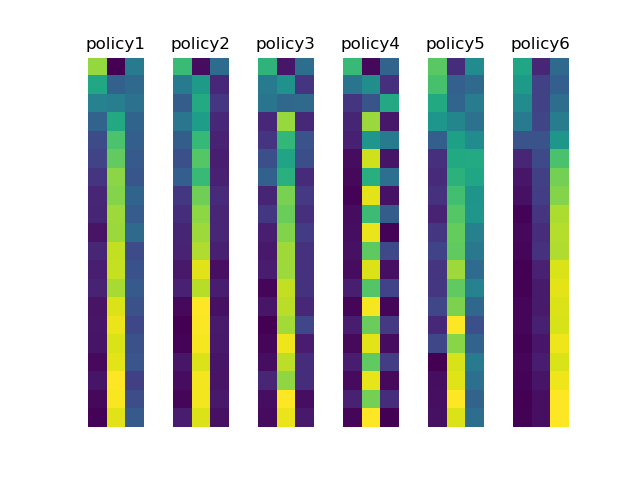

# abstract_battle

## 简介

石头剪刀布（Rock-Scissors-Paper，以下简称RSP）是一种简单的博弈游戏，石头克制剪刀，剪刀克制布，纳什均衡下的混合策略是石头，剪刀，布的出手概率均为1/3。接下来，我们适当扩展一下石头剪刀布的规则，定义以下规则：

对战双方各拥有5点hp，1点初始攻击力，并且拥有以下三种动作：

- 攻击：若攻击成功，会对对方hp造成攻击力的伤害
- 防守：防御会使对方攻击无效，并且恢复对应的hp；连续防御成功率会减半
- 充能：攻击力上升1

这样就构成了一个简单的类RSP博弈，并且这种博弈是很多指令回合制RPG的原型，接下来，我们用强化学习的方法来求解一下该游戏的纳什均衡。

## 神经虚拟自博弈（NFSP）

网上貌似关于NFSP的资料很少，NFSP是虚拟自博弈（Fictious Self Play，简称FSP）的神经网络版本，FSP是虚拟博弈（Fictious Play，简称FP）的改进版本，这里我将简单介绍一下这一类方法的思想。

在现实中，两位玩家会经过不断地相互博弈后，达到纳什均衡。FP沿用了这个思路，我们以RSP为例，讲解一下FP是怎样达到纳什均衡的。

我们假设有两个玩家A，B，他们会记得对方的策略，并且据此调整自己的策略。A的最初策略是一直出剪刀，B最初的策略是一直出石头。

在两位交战了10回合之后，A总结出B出石头的概率是100%，B总结出A出剪刀的概率是100%，于是A改进了自己的策略，决定一直出布；B知道自己的策略暂时占优所以不改动策略。又交战了10回合，B总结出A出剪刀的概率为50%，出布的概率是50%，于是决定一直出剪刀，因为一直出剪刀自己不会输；在不断地交战，不断地改进策略后，两人最后的策略会停留在出石头，剪刀，布的出手概率均为1/3。

我们会发现FP适用的场景为这种标准的单回合博弈（Normal-form game），而FSP将FP的思想拓展到序列决策的博弈中，比如我们上面定义的这种游戏中。FSP的核心思路延续自FP：

1. 根据对手的策略寻找最优策略

2. 综合自己的最优策略，得到平均策略

使用平均策略的原因，是因为只寻找最优策略会很容易过拟合，造成自己的策略失去随机性。

NFSP使用了深度强化学习替换步骤1，深度学习替换步骤2，从而得到的深度学习模型即是我们想要的最终模型。

## 实验  

因此，我们使用一个Dual-DQN作为强化学习模型（TODO：DQN稳定性不好，之后替换成PPO），胜利的reward为1，失败为-1，平局为-0.5，一个两层的全连接网络作为平均策略模型，经过400w回合的对战之后，训练loss如下：

无论是A还是B，loss长得都是差不多的，RL loss先上升后下降是因为在RL中策略使用的是$\epsilon-$greedy的方式，$\epsilon$值随回合数不断下降，因此后面RL的loss才不断下降。

两个模型对战一直处于五五开的局面，因此也没有出现一个模型碾压另一个模型的过拟合的情况。

作为验证，每1000回合，训练出来的平均策略就会和一个完全随机出招的敌人进行对决，我们可以看到胜率在50%左右波动。

## 策略评估

### 问题定义

有一个比较棘手的问题，那就是如何判断策略达到了纳什均衡，根据定义：

>所谓纳什均衡，指的是参与者的一种策略组合，在该策略上，任何参与人单独改变策略都不会得到好处，即**每个人的策略都是对其他人的策略的最优反应**。换句话说，如果在一个策略组合上，当所有其他人都不改变策略时，没有人会改变自己的策略，则该策略组合就是一个纳什均衡。

如果A和B已经达到了纳什均衡，那么，

1. A和B相互对战的胜率应该在训练中始终保持50%左右

   在实际训练过程中，很多时候会有一个模型的胜率一直处于上升状态，这是强化学习或者说是DQN训练不稳定所造成的结果，如果训练正常，强化学习是在寻找针对对手策略的最优策略，因此胜率不应该稳定上升或下降。

2. 纳什均衡时时刻刻都是最优策略吗？

   显然不是，如果已知对手的策略，最优策略一定是根据对手策略得到的策略而不是纳什均衡。

3. 什么是局部均衡？

   我们回顾一下虚拟自博弈的流程，A和B始终处于寻找针对对方的最优策略的过程中，如果A和B都局限在了一个全部策略的子集当中，所达到的均衡则是一种局部的均衡——因为没有考虑到该子集之外的策略。

4. 如何突破局部均衡？

   是个很大的话题，先不在这里讨论了，感觉是一个强化学习中经典的**exploration v.s. explotitation**的问题。局部均衡是否可用？当然是可用的，现在各类的优化问题也不一定要优化到全局的最优解。

因此，如何评估我们得到的策略好坏呢？

1. 观察训练过程中A和B相互对战的胜率
2. 用一揽子人工制定的策略对模型进行测试，希望胜率不会跌到很低；同时也不应奢求对一揽子策略一直保持高胜率，因为，纳什均衡毕竟不是最优策略。

评估策略集：根据以往的经验，制定了以下几种评估策略

1. 完全随机策略：随机从攻击，防御，充能中选择出招
2. 完全攻击策略：一直进行攻击
3. 攻击充能轮流：奇数回合攻击，偶数回合充能
4. 攻击防御轮流：奇数回合攻击，偶数回合防御
5. 养精蓄锐(0.5)：对方防御成功率为0.5的时候攻击，其余时刻充能
6. 养精蓄锐(0.25)：对方防御成功率为0.25的时候攻击，其余时刻充能

### 实验结果

以上六种评估策略，在模型A和模型B上的结果为：

| 胜率  | 完全随机策略 | 完全攻击策略 | 攻击充能轮流 | 攻击防御轮流 | 养精蓄锐(0.5) | 养精蓄锐(0.25) |
| ----- | ------------ | ------------ | ------------ | ------------ | ------------- | -------------- |
| 模型A | 0.33         | 0.184        | 0.174        | 0.388        | 0.845         | 0.965          |
| 模型B | 0.428        | 0.995        | 0.431        | 0.317        | 0.3           | 0.459          |

相对来说，模型B的性能更均衡一些，对阵各种策略的方差也较小一点，更符合之前定下的纳什均衡的标准。

## 策略解读

接下来，我们可视化A和B在和评估策略对战时，前20回合的动作选择概率，图1是A，图2是B。

从结果来看，A时更擅长进攻的策略，B是更擅长防御的策略。A和B在面对不同的敌对策略的时候，也展现了一定的变化。

## 后续

1. 训练还不完全，还可以训练更多的轮次来得到更优化的策略
2. DQN之后有希望换成PPO
3. demo上可以放上新做的模型
